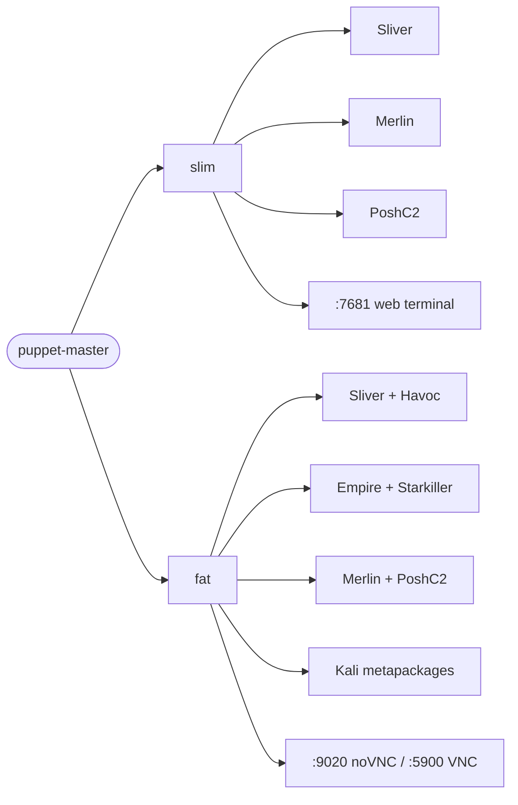

[](https://github.com/BenjiTrapp/puppet-master/actions/workflows/docker-publish.yml)

<p align="center">

</p>

> **Disclaimer:** This tooling is provided for educational purposes, authorized penetration testing engagements, and CTF competitions only. I am not responsible for any misuse or damage caused. Use these powers wisely and stay on the right side of the law.

---

## What is Puppet Master?

Puppet Master is a Dockerized C2 (Command & Control) lab environment. It comes in two flavors — a lightweight **slim** image built around a browser-accessible terminal, and a full-fat **Kali Linux** image with a noVNC desktop — giving you a ready-to-go offensive toolkit without touching your host system.



---

## Quick Start

### Pull the pre-built slim image

```bash
docker pull ghcr.io/benjitrapp/puppet-master:main
```

### Run slim (browser terminal, port 7681)

```bash
docker run --rm -it -p 7681:7681 --name puppet-master ghcr.io/benjitrapp/puppet-master:main
```

Then open **http://localhost:7681** in your browser.

### Run fat (noVNC desktop, Kali)

```bash
# Build first (not published to registry)
make build_fat

docker run --rm -it -p 9020:8080 -p 9021:5900 --name kali-puppet-master kali-puppet-master
```

Then open **http://localhost:9020/vnc.html** in your browser.

---

## Building Locally

```bash
# Build slim image
make build_slim

# Build fat (Kali) image
make build_fat

# Start slim
make start_slim

# Start fat + open browser to noVNC
make start_fat
make browser
```

---

## Accessing the Running Container

```bash
# Drop into a bash shell inside a running container
docker exec -it puppet-master /bin/bash
```

### VNC with a custom password (fat image)

```bash
docker run --rm -it \
  -p 9020:8080 -p 9021:5900 \
  -e VNCPWD=mypassword \
  --name kali-puppet-master kali-puppet-master
```

---

## Installed Tooling

### C2 Frameworks

| Framework | Slim | Fat | Notes |
|---|:---:|:---:|---|
| [Sliver](https://github.com/BishopFox/sliver) | ✅ | ✅ | Binary + compile deps (Go, mingw-w64) |
| [Merlin](https://github.com/Ne0nd0g/merlin) | ✅ | ✅ | Server + agent |
| [PoshC2](https://github.com/nettitude/PoshC2) | ✅ | ✅ | PowerShell-based C2 |
| [Havoc](https://github.com/HavocFramework/Havoc) | — | ✅ | Modern C2 with GUI teamserver |
| [PowerShell-Empire](https://github.com/BC-SECURITY/Empire) | — | ✅ | via Kali apt |
| [Starkiller](https://github.com/BC-SECURITY/Starkiller) | — | ✅ | Empire web UI |

### Kali Metapackages (fat only)

- `kali-linux-core`
- `kali-desktop-xfce`
- `kali-tools-web`
- `kali-tools-windows-resources`
- `kali-tools-top10`
- `kali-tools-passwords`
- `kali-tools-post-exploitation`

### Recon & Enumeration (fat)

- `gobuster` / `dirb` — directory brute-forcing
- `bloodhound` — AD attack path analysis
- `sslscan` — TLS configuration auditing
- `cewl` — custom wordlist generation from websites
- `enum4linux` — SMB/NetBIOS enumeration

### Password Attacks (fat)

- `hashcat` + `hydra` + `medusa` + `ncrack`
- [SecLists](https://github.com/danielmiessler/SecLists)
- [password_cracking_rules](https://github.com/NotSoSecure/password_cracking_rules)
- [Hob0Rules](https://github.com/praetorian-inc/Hob0Rules) *(archived, static)*

### Cloud / Azure Attacks (fat)

- [ROADrecon](https://github.com/dirkjanm/ROADtools) — Azure AD reconnaissance
- [ROADtx](https://github.com/dirkjanm/ROADtools) — Azure token manipulation
- JupyterLab — interactive notebooks for cloud data analysis

### Infrastructure & Protection (fat)

- `tor` + `proxychains4` — traffic anonymization
- `nginx` — reverse proxy
- `supervisord` — process supervision
- `fail2ban` — brute-force protection
- VNC (tightvncserver) + noVNC — browser-accessible desktop

---

## Environment Variables (fat image)

| Variable | Default | Description |
|---|---|---|
| `VNCPWD` | `password` | VNC login password |
| `VNCPORT` | `5900` | Raw VNC port |
| `NOVNCPORT` | `8080` | noVNC web port |
| `VNCDISPLAY` | `1920x1080` | Desktop resolution |
| `VNCDEPTH` | `16` | Color depth |
| `VNCEXPOSE` | `1` | `1` = bind all interfaces, `0` = localhost only |
| `DNS_NAMESERVER` | `8.8.8.8` | DNS resolver used at startup |

---

## Resources

### Reference

- [The C2 Matrix](https://www.thec2matrix.com) — framework comparison table
- [Kali Metapackages](https://tools.kali.org/kali-metapackages)

### Reading

- [A Comparison of C2 Frameworks — SANS](https://www.sans.org/cyber-security-summit/archives/file/summit-archive-1574188899.pdf)
- [Flying a False Flag — Black Hat 2019](https://i.blackhat.com/USA-19/Wednesday/us-19-Landers-Flying-A-False-Flag-Advanced-C2-Trust-Conflicts-And-Domain-Takeover.pdf)
- [A First Look at Today's C2 Frameworks — Foregenix](https://www.foregenix.com/blog/a-first-look-at-todays-command-and-control-frameworks)

### Watching

- [RedViper](https://www.youtube.com/watch?v=rk4EMhq30-M)
- [Command & Control Tools Course (Pt-BR)](https://www.youtube.com/watch?v=bUqu8fh7xUg)
- [How Hackers Use Discord To Control Victim PCs](https://www.youtube.com/watch?v=_OXyb_Oxmjg)
